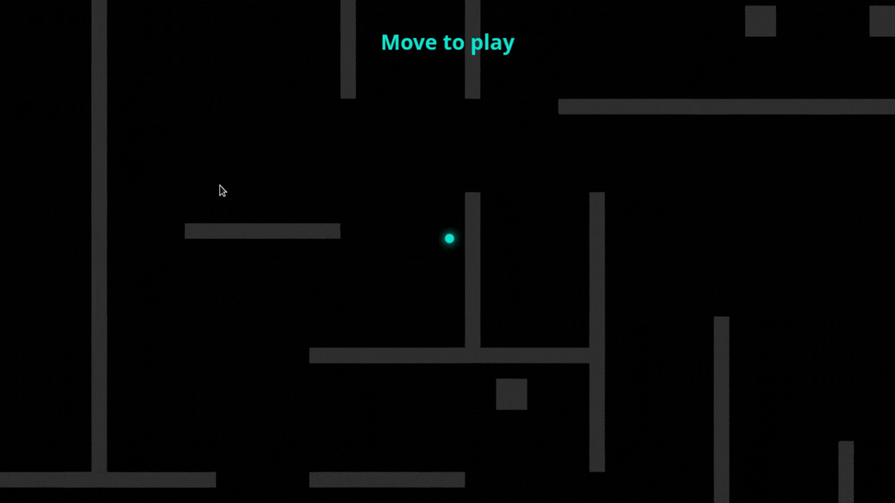

# 🏎️ Drift Maze Multiplayer

A minimalist, high-speed multiplayer maze game built using HTML5 Canvas, Node.js, Express, and Socket.io. Players navigate through a procedurally server-generated maze with "drifty" physics, bouncing off walls, and seeing other players in real-time.



## Live demo

https://drift-game.onrender.com

## 🚀 Features

* **Real-time Multiplayer:** Connected clients can instantly see and interact within the same maze environment via WebSockets (`Socket.io`).
* **Procedural Maze Generation:** The server dynamically generates a unique labyrinth layouts using grid-based logic on startup.
* **Drift Physics & Collisions:** Smooth acceleration/friction control mechanics combined with responsive wall collision bouncing and stun indicators.
* **Dynamic Camera:** A smooth easing camera that follows the player and auto-scales depending on your screen resolution.
* **Cross-Device Support:** Supports both Mouse movements (Desktop) and Touch inputs (Mobile/Tablets).

---

## 🛠️ Tech Stack

* **Frontend:** HTML5 Canvas, JavaScript (ES6+), CSS3
* **Backend:** Node.js, Express
* **Networking:** Socket.io (WebSockets)

---

## 📦 Installation & Setup
1. Run next commands in the terminal:
```
git clone https://github.com/VladProgrammerBot/Drift-game.git
cd Drift-game
npm i
node index.js
```
2. Follow the link: http://localhost:3000
